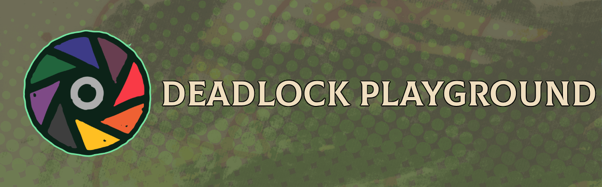

  
   
  <a href="https://www.vecteezy.com/free-vector/pop-art-texture">Pop Art Texture Vectors by Vecteezy</a>

# Deadlock 3D Playground

**Deadlock 3D Playground** | by Julián Caceres  

An open-source, community-driven tool designed to view, inspect, and pose 3D character models from Valve's Deadlock for art reference, virtual photography, and content creation.

---

## Built With & Open Source Credits

* **Engine:** Powered by [Godot Engine 4](https://godotengine.org/) (.NET / C#).
* **Asset Pipeline:** Powered by [ValveResourceFormat (Source 2 Viewer)](https://github.com/ValveResourceFormat/ValveResourceFormat), maintained by the Steam Database community.
* **Assets & Tools:**
  * Intro Background by [ayeaka](https://ayeaka.itch.io/ayeaka)
  * Gizmo3D Plugin by [chrisizeful](https://github.com/chrisizeful/Gizmo3D)

---

## Legal Disclaimer & Intellectual Property

Deadlock, Source 2, the Source 2 logo, Valve, and the Valve logo are trademarks and/or registered trademarks of **Valve Corporation**. All character models, textures, animations, and related assets extracted or rendered by this application are the copyrighted property of Valve Corporation.

This project is an unofficial, non-commercial fan creation. It is neither affiliated with, endorsed by, nor sponsored by Valve Corporation. No proprietary game files are bundled, redistributed, or sold with this software; assets are parsed locally from the user's personal installation of Deadlock.
