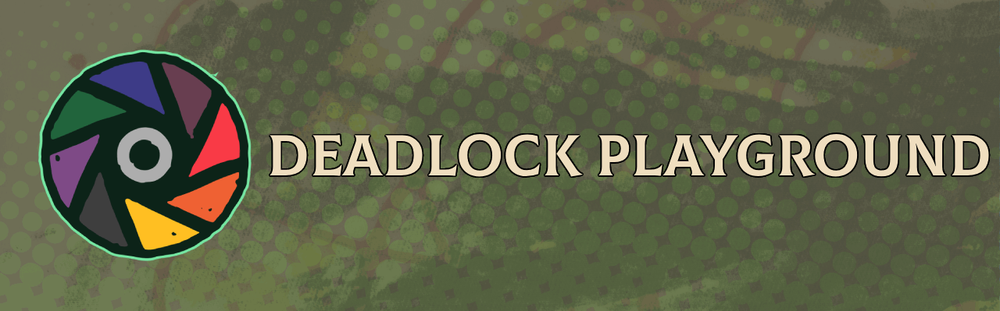

<p align="center">
  
  <br>
  <sub><a href="https://www.vecteezy.com/free-vector/pop-art-texture">Pop Art Texture Vectors by Vecteezy</a></sub>
</p>

<div align="center">

# Deadlock Playground

**A 3D character posing, real-time texture painting, and model inspection suite for Valve's *Deadlock*.**

[](https://godotengine.org/)
[](https://dotnet.microsoft.com/)
[](LICENSE)
[](#requirements--setup)

</div>

---

## Overview

**Deadlock Playground** is an open-source,  desktop application designed to view, inspect, pose, and paint 3D character models from Valve's *Deadlock*. It is built from the ground up for modders and community, providing direct, native access to Source 2 assets without requiring external export pipelines or heavy 3D DCC software suites.

## Core Features

### 1. Direct Source 2 Asset Loading
* **Native VPK Ingestion:** Directly opens and extracts assets from Valve's `pak01_dir.vpk` archive using [ValveResourceFormat](https://github.com/ValveResourceFormat/ValveResourceFormat).
* **Source 2 Binary Formats:** Automatically decodes compiled Source 2 files on the fly:
  * `.vmdl_c` (3D character models, skeletons, and submeshes)
  * `.vmat_c` (Valve KV3 materials, shader parameters, and textures)
  * `.vtex_c` (BC7 / DXT / RGBA compressed texture buffers via Skia decoding)
  * `.vanim_c` (Retargeted skeletal animation sequences)
* **Auto-Discovery:** Automatically detects local Steam libraries and Deadlock installation directories.
* **Extensive Hero Catalog:** Built-in catalog indexing heroes, legacy heroes, and weapon meshes with normalized alias resolution.

### 2. Skeletal Posing & Animation Studio
* **Standalone & Additive Animation Playback:**
  * Plays standard animation sequences (idles, locomotion, emotes, combat stances).
  * Ingests and plays additive modifier layers (recoil, weapon aim offsets, firing deltas) with coordinate conversion (Source 2 Z-up $\to$ Godot Y-up) and rest-pose elevation preservation to prevent joint warping or hip collapse.
* **Forward Kinematics (FK) Posing:** Manipulate individual bones directly in the 3D viewport using the integrated [Gizmo3DSharp](https://github.com/chrisizeful/Gizmo3D) transform manipulator.
* **Full-Body Two-Bone Inverse Kinematics (IK):** Interactive IK handles for arm and leg chains with anatomical joint angle constraints, plus dedicated head/eye look-at gaze targets.
* **Procedural Cloth Simulation (PBD):** Real-time Position-Based Dynamics physics solver simulating skirts, cloaks, capes, and hair chains conforming dynamically to posed joint positions.
* **Bone Masking & Hierarchy Groups:** Filter and isolate skeleton structures across Deform, IK, Cloth, Facial, and Auxiliary bone groups.

### 3. In-Engine 2D / 3D Texture Painting & Skin Studio
* **Simultaneous 3D & 2D Canvas Painting:** Paint directly on the character model in the 3D viewport via orthographic GPU compute projection, or paint on the flattened 2D UV unwrapped texture dock.
* **Non-Destructive Multi-Layer Stack:** Full layer manager supporting multiple canvas layers, visibility toggling, layer opacity, and standard blend modes (*Normal*, *Multiply*, *Screen*, *Overlay*). Layer 0 remains protected as the immutable original diffuse texture.
* **Comprehensive Brush Suite:** Configurable brush radius, hardness, spacing, opacity, flow, jitter, and procedural shapes (*Soft Circle*, *Hard Circle*, *Splatter*, *Grunge*, *Square*).
* **Advanced Selection Tools:**
  * **Magic Wand:** Perceptual sRGB BFS flood-fill on the UV texture atlas with customizable tolerance and contiguous fill settings.
  * **Mask Feathering & Isolation:** Selection mask perimeter dilation, anti-aliased edge softening, and strict compute shader discard to prevent paint bleed into unselected submeshes.
* **Decal Stamper & 3D Text Projector:** Interactively position, scale, and project external PNG decals or vector typography onto surfaces and bake directly into active layers.
* **Undo / Redo Buffer:** Dedicated per-character stroke and layer history tracking.
* **Direct Mod Export:** In-place VTEX interception that automatically compiles custom skins into collision-free `pak##_dir.vpk` archives directly into `game/citadel/addons/` for immediate in-game testing.

### 4. Shading & Materials Pipeline
* **PBR vs. Toon Switcher:** Instant toggling between authentic PBR materials and stylized NPR Toon shading with customizable outline width, color, and depth offsets.
* **Hero Bespoke Shaders:**Shader for character-specific effects for customization:
  * **Infernus:** arm glow and flame plume hair.
  * **Lady Geist:** Spectral arm tinting.
  * **Viscous:** Translucent slime volume rendering, interior core protection, and hull exclusion.
  * **Vindicta:** Translucent spectral aura.
  * **Lash:** Animated gold shoulder sparkles with desynchronized step wiping.
  * **Wraith** Cards glow and translucent effect.


### 5. Virtual Photography & High-Resolution Image Export
* **Studio Orbit Camera:** Smooth turntable orbit, pan, dolly zoom, and frame-selection (`F` key) camera controller.
* **High-Res Viewport Capture:** Export screenshots up to 4K resolution with optional transparent backgrounds.
* **Overlays & Environment Customization:** Toggle bone wireframes, gizmo handles, studio backdrops, and lighting setups.

### 6. Seamless GitHub Releases Auto-Updater
* Built-in `UpdateChecker` that automatically queries the GitHub Releases API for new builds, stages update packages, and cleans up post-update temporary files seamlessly upon restart.


## Requirements & Setup

### Prerequisites
1. **Godot Engine 4.7.2 (.NET / C# version):** Download the standard .NET build of Godot 4.7.2 from [godotengine.org](https://godotengine.org/download/).
2. **.NET 10.0 SDK:** Install the [.NET 10 SDK](https://dotnet.microsoft.com/download/dotnet/10.0).
3. **Deadlock Installation:** A local installation of *Deadlock* on Steam (the application reads `pak01_dir.vpk` from your local game directory to ingest character models, textures, and animations).

### Building from Source

```bash
# 1. Clone the repository
git clone https://github.com/juliancz-a/deadlock-playground.git
cd deadlock-playground

# 2. Restore NuGet dependencies
dotnet restore src/Deadlock_Playground.csproj

# 3. Build the managed assembly
dotnet build src/Deadlock_Playground.csproj

# 4. Launch with Godot
godot --path src/
```

> **Note:** You can also open the repository directly by launching Godot and importing `src/project.godot`, or by opening `Deadlock_Playground.sln` in Visual Studio / JetBrains Rider / VS Code.

---

## Built With & Open Source Credits

* **Engine:** Powered by [Godot Engine 4](https://godotengine.org/) (.NET / C#).
* **Asset Pipeline:** Powered by [ValveResourceFormat (Source 2 Viewer)](https://github.com/ValveResourceFormat/ValveResourceFormat), maintained by the Steam Database community.
* **SVG Icons:** [at-icons](https://github.com/Voxybunsl/at-icons) (MIT License) by Voxybuns.
* **GPU Texture Painter Plugin:** [gpu-texture-painter](https://github.com/maantho/gpu-texture-painter) (MIT License) by maantho.
* **Gizmo3D Plugin:** [Gizmo3D](https://github.com/chrisizeful/Gizmo3D) (MIT License) by chrisizeful.
* **Vector Textures:** [Pop Art Texture Vectors](https://www.vecteezy.com/free-vector/pop-art-texture) by Vecteezy.

---

## Legal Disclaimer & Intellectual Property

*Deadlock, Source 2, the Source 2 logo, Valve, and the Valve logo are trademarks and/or registered trademarks of **Valve Corporation**. All character models, textures, animations, and related assets extracted or rendered by this application are the copyrighted property of Valve Corporation.*

*This project is an unofficial, non-commercial fan creation. It is neither affiliated with, endorsed by, nor sponsored by Valve Corporation. No proprietary game files are bundled, redistributed, or sold with this software; assets are parsed locally from the user's personal installation of Deadlock.*

---

## License

This project is licensed under the **MIT License**. See the [LICENSE](LICENSE) file for complete details.
